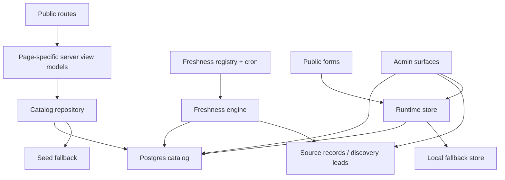

# Architecture

## Overview

`kinelo.fit` is a Next.js App Router application with:
- a typed catalog domain
- a DB-first catalog repository with seed fallback
- cached public read models for city-level pages
- a runtime store for user state and public submissions
- an operations layer for freshness, imports, and moderation

At a high level, the system is designed to keep public browsing reliable even when configuration or upstream sources are imperfect.

## Tech stack

### Framework and runtime
- Next.js 15 App Router
- React 19
- TypeScript

### UI and rendering
- Tailwind CSS v4
- HeroUI components where useful
- MDX for editorial content
- Framer Motion for selected motion treatment

### Data and persistence
- Drizzle ORM
- Postgres via Supabase-compatible `DATABASE_URL`
- Supabase Auth for magic-link and OAuth flows

### Mapping and time
- Leaflet for public maps
- Carto / OSM-compatible tile configuration by default
- Supercluster for marker clustering
- Luxon for schedule, timezone, and date logic

### Quality and operations
- Vitest
- Node test runner
- Playwright
- ESLint
- Sentry package present for monitoring/instrumentation

## Route architecture

Routes live under `app/` and are grouped by concern.

### Public routes
Important public route groups include:
- `app/[locale]/page.tsx`
- `app/[locale]/[city]/page.tsx`
- `app/[locale]/[city]/classes/*`
- `app/[locale]/[city]/studios/*`
- `app/[locale]/[city]/teachers/*`
- `app/[locale]/[city]/neighborhoods/*`
- `app/[locale]/[city]/categories/*`
- `app/[locale]/[city]/collections/*`
- `app/[locale]/favorites`
- `app/[locale]/schedule`
- `app/[locale]/account`
- `app/[locale]/sign-in`
- `app/[locale]/suggest-calendar`
- `app/[locale]/claim/[studioSlug]`

### Admin routes
Operational routes include:
- `app/[locale]/admin`
- `app/[locale]/admin/inbox`
- `app/[locale]/admin/imports`
- `app/[locale]/admin/freshness`
- `app/[locale]/admin/sources`
- `app/[locale]/admin/collections`
- `app/[locale]/admin/taxonomy`
- `app/[locale]/admin/health`

### API routes
Operational and stateful server routes include:
- auth routes
- `calendar-submissions`
- `claims`
- `digest`
- `state/favorites`
- `state/schedule`
- `session/status`
- admin review/import routes
- cron freshness route

## Rendering model

The route layer is meant to stay thin.
Each page should:
1. load a typed catalog slice or public city snapshot
2. derive a page-specific view model
3. render server-first HTML
4. hand off to client components only where interaction is justified

This is a deliberate tradeoff:
- public browsing remains resilient and indexable
- client bundles stay smaller than a client-only app
- highly interactive surfaces like filters, maps, and sharing still work smoothly

## Catalog domain model

The catalog domain lives under `lib/catalog/`.
The primary type system models:
- cities
- neighborhoods
- activity categories
- styles
- instructors
- venues
- booking targets
- sessions
- editorial collections

Design rule:
- public UI consumes typed catalog data, not ad-hoc raw records

This keeps filters, mapping, moderation, and imports coherent.

## Canonical catalog read path

Main entry:
- `lib/catalog/repository.ts`

The repository follows a DB-first strategy.

### Current read order
1. Try to read canonical catalog tables from Postgres.
2. Normalize dates, numbers, and price notes.
3. Overlay seed-only media where the DB row does not carry that asset yet.
4. Project valid one-off `source_event_candidate` records into public sessions.
5. Fall back to the seed snapshot when DB access is unavailable.

This allows:
- stable local development with no DB
- DB-backed production reads
- gradual migration from seed-first to database-first operation

## Public read models

Main files:
- `lib/catalog/public-models.ts`
- `lib/catalog/public-read-models.ts`
- `lib/catalog/search-index.ts`

### Why these exist
The app no longer wants every public route to rebuild a broad city slice from raw tables on every request.
The public read models provide:
- denormalized city snapshots for SSR
- a smaller filter-oriented search index for fast client interactions

### Public city snapshot
Contains, per public city:
- city metadata
- neighborhoods
- categories and styles
- instructors and venues
- booking targets
- public sessions
- editorial collections
- city metrics
- precomputed map venue summaries
- precomputed studio summaries
- precomputed teacher summaries

### Public city search index
Contains a smaller session-focused index used for fast client filtering after hydration.
It carries:
- the fields needed for filtering
- search text
- time bucket
- weekday
- neighborhood slug
- schedule metadata

### Caching and invalidation
The read-model layer uses:
- `unstable_cache`
- tag-based invalidation

Current city tags:
- `city:{slug}:public`
- `city:{slug}:classes`
- `city:{slug}:studios`
- `city:{slug}:teachers`

If read-model tables are unavailable, the layer falls back safely to an on-the-fly snapshot instead of crashing the page.

## Server data layer

Main file:
- `lib/catalog/server-data.ts`

This is a convenience layer for route code.
It exposes page-oriented getters such as:
- `getCity`
- `getSessions`
- `getVenue`
- `getInstructor`
- `getCollections`
- `getCityMetrics`

This keeps route files readable and centralizes consistent filtering behavior.

## Runtime store

Main file:
- `lib/runtime/store.ts`

The runtime store powers state and inbound operational flows that are not part of the canonical catalog tables.

Current responsibilities include:
- claim submissions
- calendar submissions
- digest subscriptions
- favorites
- saved schedule
- outbound click tracking
- user profiles

### Persistence strategy
- use Postgres when `DATABASE_URL` is configured
- fall back to `/tmp/kinelo-fit-runtime` where allowed
- in production, persistent storage is expected

This lets development remain usable without pretending that fallback storage is a production-grade answer.

## Auth architecture

Main files:
- `lib/auth/session.ts`
- `lib/auth/supabase.ts`
- `lib/runtime/capabilities.ts`

### Current auth modes
- `supabase`
- `dev-local`
- `unavailable`

### Behavior
- public browsing never depends on auth
- if Supabase is configured and auth cookies exist, the server resolves a real user
- in local development and preview, a demo session path can exist when Supabase is absent
- signed-in utilities are additive, not foundational to the public app

### Why this matters
This architecture prevents auth misconfiguration from taking down the core discovery experience.

## Runtime capability layer

Main files:
- `lib/runtime/capabilities.ts`
- `lib/env.ts`
- `lib/ops/health.ts`

This layer centralizes environment and capability decisions such as:
- whether auth is available
- whether persistent store is available
- whether the map provider config is valid
- whether release-critical health checks are passing

Known degraded states should render as explicit product states, not as leaked implementation errors.

## Map architecture

Main files:
- `lib/map/config.ts`
- `lib/map/runtime.ts`
- `lib/map/venue-summaries.ts`
- `components/discovery/MapCanvas.tsx`
- `components/discovery/LeafletMapStage.tsx`

### Current design
- public map is Leaflet-based
- tiles come from Carto / OSM-compatible configuration
- the map no longer depends on a proprietary token just to render publicly
- clustering is handled client-side
- server code precomputes venue summaries so the client does not need raw catalog reconstruction

### Core flow
1. server groups sessions into `MapVenueSummary`
2. client map consumes venue summaries rather than raw session joins
3. URL state preserves `view=map` and `venue=<slug>`
4. mobile and desktop use different presentation shells on top of the same map base

## Media architecture

Main files:
- `lib/media/public-videos.ts`
- `components/media/LoopVideo.tsx`
- `next.config.ts`

### Current behavior
- editorial video assets are registered centrally
- the hero video loads eagerly
- secondary videos lazy-start when they intersect the viewport
- reduced-motion and save-data preferences suppress autoplay
- allowed remote image origins are explicitly listed in `next.config.ts`

The media layer is intentionally small and explicit.
It avoids unconstrained remote image origins and prevents offscreen videos from burning bandwidth unnecessarily.

## Admin and moderation architecture

Main files:
- `components/admin/AdminInbox.tsx`
- `lib/admin/safe.ts`
- `app/api/admin/review/route.ts`

### Design
The admin system is intentionally operational rather than decorative.
It exists to:
- show runtime truth
- review inbound items
- manage source freshness and imports
- keep catalog quality above threshold

### Safety strategy
Admin reads are wrapped with `safeAdminRead` so a single failed query does not collapse the entire surface into a `500`.
That is a pragmatic reliability choice: operator tooling should degrade, not disappear.

## Import architecture

Main files:
- `app/[locale]/admin/imports/page.tsx`
- `lib/catalog/import-validator.ts`
- `scripts/validate-import.ts`

The product still supports CSV-first ingestion because manual curation remains important.
The import validator checks:
- scope
- URL validity
- attendance model coverage
- pricing coverage
- coordinates
- ISO datetime shape
- catalog policy compliance

This is a deliberate tradeoff in favor of quality over reckless ingestion speed.

## Automation architecture

The automation layer is described in detail in:
- [docs/automation.md](/Users/nicoladimarco/code/kinelofit/docs/automation.md)

At the architectural level, it is composed of:
- source registry
- freshness runs
- parser adapters
- candidate extraction
- moderation and review queues
- public read-model rebuilds

## Deployment and runtime assumptions

### Platform shape
Current deployment assumptions are:
- Next.js app on Vercel
- Supabase Postgres for DB-backed state and catalog
- Supabase Auth for sign-in
- Vercel cron triggering freshness routes

### Cron jobs
Current scheduled jobs in `vercel.json`:
- daily freshness run
- weekly freshness run
- quarterly discovery/freshness run

## Environment variables

Key runtime variables:
- `DATABASE_URL`
- `NEXT_PUBLIC_SUPABASE_URL`
- `NEXT_PUBLIC_SUPABASE_ANON_KEY`
- `APP_SESSION_SECRET`
- `NEXT_PUBLIC_SITE_URL`
- `NEXT_PUBLIC_MAP_TILE_URL`
- `NEXT_PUBLIC_MAP_TILE_ATTRIBUTION`
- `NEXT_PUBLIC_MAP_TILE_SUBDOMAINS`
- `CRON_SECRET`

Operational expectations:
- production should be DB-backed
- production should have Supabase auth configured
- production should have a valid public site URL
- public maps should work with default tiles even without custom provider overrides

## Security posture

Recent hardening includes:
- Row Level Security enabled on the public Supabase schema
- public reads routed through app/server logic rather than open client-side table exposure
- explicit allowed image origins instead of broad wildcards
- public forms moderated rather than auto-publishing content

This keeps the public app safer and the data model more controllable.

## Testing and release discipline

The architecture is supported by a layered test stack:
- unit/domain tests
- route and contract tests
- critical Playwright flows
- smoke routes
- release-gate scripts

Reference docs:
- [docs/testing/test-strategy.md](/Users/nicoladimarco/code/kinelofit/docs/testing/test-strategy.md)
- [docs/testing/release-checklist.md](/Users/nicoladimarco/code/kinelofit/docs/testing/release-checklist.md)
- [docs/testing/ux-flows.md](/Users/nicoladimarco/code/kinelofit/docs/testing/ux-flows.md)

## Architectural decisions that matter most

### DB-first, seed fallback
This let the product ship early while still moving toward a real operating system backed by Postgres.

### Public-first reliability
The public app should keep working even when some infrastructure is absent or degraded.

### Typed catalog everywhere
Types reduce ambiguity across discovery, automation, imports, and moderation.

### Trust tiers in automation
Not all sources deserve the same level of automatic influence.
The architecture encodes that explicitly.

### Server-first pages with selective client enhancement
This keeps the public app lighter and more resilient while still supporting map, filters, and saved-state interactions.

## Related docs

- [docs/product-overview.md](/Users/nicoladimarco/code/kinelofit/docs/product-overview.md)
- [docs/features-and-flows.md](/Users/nicoladimarco/code/kinelofit/docs/features-and-flows.md)
- [docs/automation.md](/Users/nicoladimarco/code/kinelofit/docs/automation.md)
- [docs/database.md](/Users/nicoladimarco/code/kinelofit/docs/database.md)
