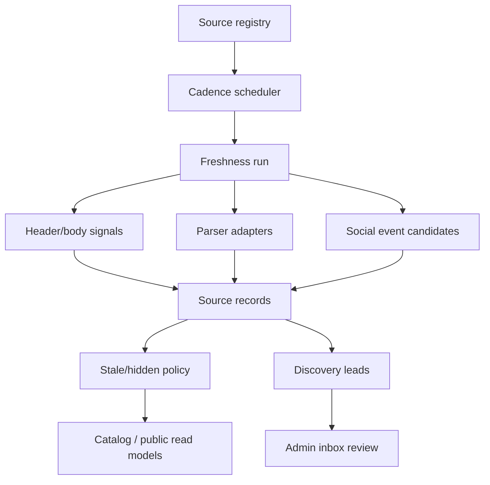

# Automation and Operations

## Purpose

Automation in `kinelo.fit` exists to keep a local class catalog useful without turning the product into a blind scraper.

The operating principle is:
- automate repetitive checking
- automate structured extraction where justified
- automate suppression and freshness bookkeeping
- keep ambiguous or low-confidence cases in review

The system should automate everything it can defend.
It should not automate false confidence.

## Operating model

Automation is split into four layers:
1. source inventory
2. scheduled checking
3. parsing and candidate extraction
4. moderation, suppression, and public projection

This is a stricter model than "crawl everything and publish changes".
It is designed to preserve catalog trust.



## Source registry

Main file:
- `lib/freshness/source-registry.ts`

The registry defines what the system watches per city.
Each source entry can carry:
- `sourceUrl`
- `sourceType`
- `cadence`
- `trustTier`
- `purpose`
- tags and notes
- optional parser adapter inference

### Source types
Examples currently used:
- `official_site`
- `events_calendar`
- `directory`
- `social`

### Purposes
Current purposes include:
- `catalog`
- `discovery`

That distinction matters:
- catalog sources can directly support freshness and schedule verification
- discovery sources are used to find new supply or leads rather than immediately shaping public truth

## Trust tiers

The registry distinguishes source quality explicitly.

### `tier_a`
Use for:
- official recurring timetable pages
- strong canonical sources

### `tier_b`
Use for:
- structured directories
- reasonably good public sources that are useful but not fully canonical

### `tier_c`
Use for:
- social roots and other noisy sources

This is one of the most important design choices in the whole system.
Without trust tiers, automation quality collapses quickly.

## Cadence strategy

Main file:
- `lib/freshness/schedule.ts`

The app does not use one giant refresh loop.
It uses separate cadences.

### Daily
Used for:
- top-value recurring official sources
- high-confidence structured sources

Goal:
- detect meaningful changes quickly where the signal is good

### Weekly
Used for:
- broader official coverage
- social pages worth checking
- event series and secondary official sources

Goal:
- keep Palermo fresh without overspending on noisy sources

### Quarterly
Used for:
- discovery sweeps
- broader lead generation
- lower-priority source exploration

Goal:
- expand supply coverage carefully, not continuously spam the system

## Scheduled execution

Current production scheduling lives in `vercel.json`.
The app exposes cron-triggered routes for:
- daily freshness
- weekly freshness
- quarterly discovery/freshness

Manual runs are also supported through scripts.

Useful commands:
```bash
npm run freshness:run
npm run freshness:run -- palermo --cadence=weekly
npm run freshness:run -- palermo --cadence=quarterly
npm run freshness:report
```

## Freshness engine

Main file:
- `lib/freshness/service.ts`

### Responsibilities
The freshness engine does the following:
1. loads due registry entries for a city and cadence
2. fetches a lightweight signal for each source
3. compares current and prior signatures
4. identifies changed, impacted, and unreachable sources
5. runs parser adapters where available
6. extracts social or event candidates where relevant
7. persists source records and run metrics
8. updates stale / hidden status according to policy
9. rebuilds public read models when the city changed materially

### Run reporting
Each run reports metrics such as:
- total sources checked
- changed sources
- unreachable sources
- impacted sources
- adapter signals
- auto-reverified sessions
- stale and hidden promotions
- discovery leads discovered
- one-off candidates discovered

This gives the operator a measurable operating loop, not just a black box cron.

## Lightweight fetch strategy

The system deliberately avoids fully scraping every source on every run.

Default strategy:
- `HEAD` first when possible
- `GET` only when required
- compare lightweight signals such as:
  - final URL
  - HTTP status
  - `etag`
  - `last-modified`
  - `content-length`
  - optional body digest when HTML is actually fetched

This keeps daily and weekly checks relatively cheap.

## Parser adapters

Main file:
- `lib/freshness/adapters.ts`

Adapters are used where a source is structured enough to extract recurring schedule signals reliably.

Current adapter coverage includes structured handling for sources such as:
- Rishi
- Taiji
- Barbara Faludi Yoga
- Diaria timetable pages

### Adapter responsibilities
- read source HTML
- identify recurring timetable structure
- derive stable session signatures
- detect likely changes with enough confidence
- auto-reverify matching sessions when safe

This is where automation becomes high leverage.

## OCR-assisted timetable extraction

Main file:
- `lib/freshness/diaria-ocr.ts`

Some sources expose schedules as image-led timetables instead of accessible HTML.
Diaria is the main example.

Current approach:
- fetch timetable images from the official calendar surface
- run OCR-assisted parsing
- emit time and weekday signals that can be used for auto-reverification

This is intentionally narrow and source-specific.
The product does not pretend OCR is a generic answer for every social or image-only timetable.

## Social and one-off event extraction

Main file:
- `lib/freshness/social-events.ts`

Social-only supply is the hardest part of the operating model.
The current architecture treats social pages as signal sources, not as unquestioned truth.

### What it tries to extract
- event-like date/time mentions
- metadata such as `og:title`, `og:description`, `description`
- structured hints from JSON-LD where available
- one-off candidate session payloads

### Why candidates instead of direct publish
Because a Facebook or Instagram root page can be:
- incomplete
- private or login-walled
- image-first
- noisy and ambiguous

Candidate extraction is the right middle ground:
- useful signal can still be captured
- low-confidence changes do not rewrite the catalog blindly

## Source records and persistence

The automation layer persists operational evidence to Postgres when available.
Key operational tables include:
- `source_registry`
- `source_records`
- `freshness_runs`
- `freshness_run_sources`
- `discovery_leads`

This persistence matters because automation should be inspectable after the fact.
A reliable operator system needs history.

## Discovery leads

Discovery leads are used for the quarterly expansion loop.
They represent:
- candidate new sources
- candidate venues
- possible scope expansions worth manual review

Leads are visible in the admin inbox rather than silently entering the public catalog.

## Stale and hidden policy

Automation is not only about detecting new content.
It is also about suppressing weak or outdated content.

Current policy direction:
- broken or changed sources can mark sessions stale
- stale sessions can age into hidden status
- previously verified sessions can be reverified when a source is reachable and unchanged
- the system avoids artificially aging out healthy supply when the source was checked successfully

This matters because catalog trust is improved as much by removing weak entries as by adding new ones.

## Public projection of one-off candidates

The catalog repository can project recent valid `source_event_candidate` payloads into public sessions.

Why this exists:
- recurring schedules and one-off events are different objects
- the public app needs to benefit from automation without forcing every event into the canonical recurring schedule tables

This is especially useful for:
- workshops
- temporary kids sessions
- special events discovered through trusted public sources

## Manual input and moderation

Automation coexists with manual inbound flows.

### Public inbound flows
- calendar submissions
- studio claims
- digest signup

### Admin review surfaces
- admin overview
- admin inbox
- imports
- freshness
- sources

### Current moderation statuses
For claims and submissions:
- `new`
- `reviewing`
- `approved`
- `rejected`
- `imported`
- `resolved`

For discovery leads:
- `new`
- `reviewed`
- `imported`
- `rejected`

This keeps operator judgment in the loop where it still matters.

## Import validation

Main files:
- `lib/catalog/import-validator.ts`
- `scripts/validate-import.ts`

The import path is still important because not all good data arrives through automated refresh.
The validator checks:
- scope
- URL validity
- coordinates
- datetime format
- pricing presence
- attendance model coverage
- catalog policy compliance

This is a deliberate quality barrier.

## Read-model rebuilds

Automation does not stop at source checks.
When catalog-relevant data changes, the system rebuilds public read models so the public app becomes fast and cacheable again.

Main file:
- `lib/catalog/public-read-models.ts`

Rebuilds can happen after:
- catalog bootstrap
- freshness runs with meaningful changes
- import flows

Effects:
- city snapshots update
- city search indexes update
- public cache tags are revalidated

## Runtime store operations

The runtime store also participates in operations.
It persists:
- claims
- calendar submissions
- digest subscriptions
- favorites
- schedule saves
- outbound events
- user profiles

This is not the same as canonical catalog automation, but it is part of the operating system of the product.

## Health and observability

Main file:
- `lib/ops/health.ts`

The health layer reports things like:
- catalog source mode
- DB availability
- store persistence mode
- map runtime mode
- auth setup
- session secret setup
- read-model availability

Operators should be able to tell when the product is healthy without inferring it from user complaints.

## Release automation and quality gates

Automation is not only about catalog freshness.
Release quality is part of the same system.

Core commands:
```bash
npm run lint
npm run typecheck
npm test
npm run build
npm run smoke:routes
npm run test:e2e
npm run catalog:coverage
npm run freshness:report
npm run perf:check
```

Reference docs:
- [docs/testing/test-strategy.md](/Users/nicoladimarco/code/kinelofit/docs/testing/test-strategy.md)
- [docs/testing/release-checklist.md](/Users/nicoladimarco/code/kinelofit/docs/testing/release-checklist.md)
- [docs/testing/ux-flows.md](/Users/nicoladimarco/code/kinelofit/docs/testing/ux-flows.md)

The principle is simple:
A fresh catalog is not enough if releases keep breaking the public experience.

## What is automated well today

Strongly automated today:
- cadence scheduling
- lightweight source checking
- freshness run persistence
- parser-backed revalidation on supported sources
- Diaria OCR-assisted signal extraction
- social candidate extraction where public metadata is usable
- public read-model rebuilds
- release smoke and test gates

## What is only partially automated

Partially automated today:
- social-only venue coverage
- one-off event ingestion from noisy sources
- broad discovery expansion
- manual import review workflows

## What still requires human judgment

Human judgment is still required for:
- low-confidence social-only sources
- ambiguous identity matching for teachers and venues
- edge cases in pricing or attendance model interpretation
- deciding whether a new source or venue is in scope
- approving calendar submissions into real catalog changes

This is not a weakness in itself.
It is part of the product's trust discipline.

## AI automation status

There is a future plan for AI-assisted calendar ingestion, but it is intentionally not active in the runtime today.

Reference plan:
- [docs/plans/ai-calendar-ingestion.md](/Users/nicoladimarco/code/kinelofit/docs/plans/ai-calendar-ingestion.md)

Current product position:
- AI ingestion is a planned future layer
- the live operating system today remains deterministic, rule-based, and moderation-backed

## Practical operator loop

A healthy week of operations looks like this:
1. daily and weekly freshness runs execute
2. changed or broken sources are recorded
3. structured sources refresh recurring confidence
4. social and event candidates are stored when extractable
5. operators review ambiguous cases in admin
6. imports or manual corrections are applied where needed
7. public read models are rebuilt and cache tags revalidated
8. the public catalog stays usable without constant full manual rebuilding

## Related docs

- [docs/product-overview.md](/Users/nicoladimarco/code/kinelofit/docs/product-overview.md)
- [docs/features-and-flows.md](/Users/nicoladimarco/code/kinelofit/docs/features-and-flows.md)
- [docs/architecture.md](/Users/nicoladimarco/code/kinelofit/docs/architecture.md)
- [docs/catalog-policy.md](/Users/nicoladimarco/code/kinelofit/docs/catalog-policy.md)
- [docs/database.md](/Users/nicoladimarco/code/kinelofit/docs/database.md)
- [docs/plans/ai-calendar-ingestion.md](/Users/nicoladimarco/code/kinelofit/docs/plans/ai-calendar-ingestion.md)
